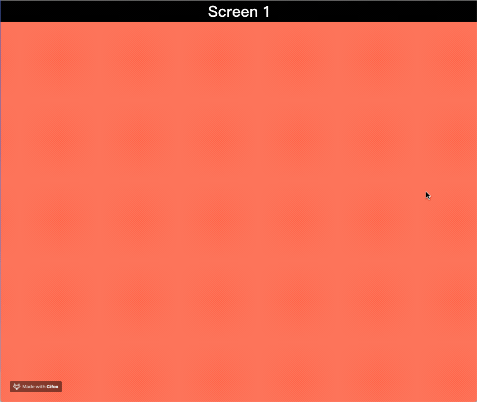
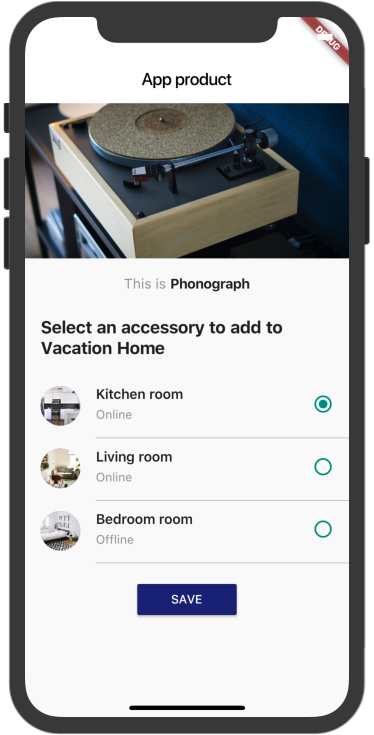

# 100 Days Of Code - Log

### Day 1: Sep 28, 2018 

**Today's Progress:** Got a new feature of CSS3 - Scroll Snap

**Thoughts:** This latest feature can make the web page works as ViewPager in a super concise way, moreover, it's pure CSS code! [Note: check browser compatibility before using]

**Link to work:** 
  [D1 - Snappy Scroll](./CSS/D1-SnappyScroll.html)
  [MDN - CSS Scroll_Snap](https://developer.mozilla.org/en-US/docs/Web/CSS/CSS_Scroll_Snap)
  [Check the browsers support version](https://caniuse.com/#search=scroll-snap)

### Day 2: Sep 29, 2018 

**Today's Progress:** The weird vertical padding

**Thoughts:** Vertical padding is relative to element's width not height. For example, `padding-top: 50%;` does not add 50% of the original *height* of the element as padding, but 50% of the *width* of the *parent* element

**Link to work:** [D2 - Vertical Padding](./codebase/CSS/D2-VerticalPadding.html)

### Day 3: Sep 30, 2018

**Today's Progress:** Start to learn Flutter, built a Simple List as my first Flutter app.

**Thoughts:** After two days working on searching the CSS&HTML material, I realized that I couldn't find a clear goal for what can I use these stuff. I asked myself, which kind of skill I want to develope exactly? Maybe the most relevant to my job, or that I would possibly use in the near future. Finally, I got an answer that Flutter is an ideal choice at the moment.

**Link to work:** [D3 - Simple List](./codebase/Flutter/simplelist)

### Day 4: Oct 2, 2018

**Today's Progress:** Implemented a list item widget by following the Flutter tutorial.

**Thoughts:** I'm starting to take the official Flutter courses on Udacity today. I accomplished the quiz and I preliminarily understand the concept of "almost everything is a widget". I also learnt some of the Dart syntax, such as construction.

**Link to work:** 
  [D4 - Category Widget](./codebase/Flutter/task_02_category_widget)
  [Flutter tutorial - Udacity](https://classroom.udacity.com/courses/ud905)
  [Dart - Sample Code](https://www.dartlang.org/samples)

### Day 5: Oct 7, 2018

**Today's Progress:** Coded the menu list and navigator by following the tutorial. Learnt the basic syntax of Dart.

**Link to work:** 
  [D5 - Category Route](./codebase/Flutter/task_03_category_route)
  [D5 - Navigation](./codebase/Flutter/task_04_navigation)

### Day 6: Oct 8, 2018

**Today's Progress:** Finished the quiz of tutorial, to convert the stateless widgets to stateful widgets. Learned the Dart syntax about list and generic.

**Link to work:** [D6 - Stateful Widget](./codebase/Flutter/task_05_stateful_widgets)

### Day 7: Oct 9, 2018

**Today's Progress:** Dived into the Stateless Widgets. Re-wrote the example of official Flutter. Afterward, I found an wonderful UI prototype on the Uplabs, and attempted to mock it using Flutter.

**Link to work:**
  [D7 - Stateless Widget practices](./codebase/Flutter/mock_static_ui)
  [uplabs: Smart Home Page - by BØ](https://www.uplabs.com/posts/smart-home-page-interface)

### Day 8: Oct 10, 2018

**Today's Progress:** Finished the remainder of yesterday's project.

**Link to work:**
  [D8 - Stateless Widget practices](./codebase/Flutter/mock_static_ui)
  [uplabs: Smart Home Page - by BØ](https://www.uplabs.com/posts/smart-home-page-interface)
 
 

### Day 9: Oct 11, 2018

**Today's Progress:** Started to study lesson 2 of Flutter tutorial about how to make the widget to be interactive. On the way to quiz of building a convertor.

**Link to work:** [D9 - input](./codebase/Flutter/task_06_input)

### Day 10: Oct 12, 2018

**Today's Progress:** Accomplished the rest of the converter app,  learnt many new widgets.

**Link to work:** [D9 - input](./codebase/Flutter/task_06_input)

### Day 11: Oct 13, 2018

**Today's Progress:** Went through 2 sections (Design basics and Images) the Cookbook of Flutter and coded all of these examples by myself.

**Link to work:** [Flutter - Cookbook](https://flutter.io/cookbook/)

### Day 12: Oct 14, 2018

**Today's Progress:** Got into the lists chapter of Flutter Cookbook, and learned the classes chapter of Dart language.

**Link to work:**
  [Dart](https://www.dartlang.org/guides/language/language-tour#initializer-list)

### Day 13: Oct 15, 2018

**Today's Progress:** Continued to learn the classes chapter of Dart language: the constructors, methods, abstract classes, encapsulation, inheritance and mixins...
Like yesterday, I did some exercises locally, so no code was commited to the repository.

### Day 14: Oct 16, 2018

**Today's Progress:** Finished navigation & animation chapters of Cookbook. Starting to learn Networking part of Flutter.