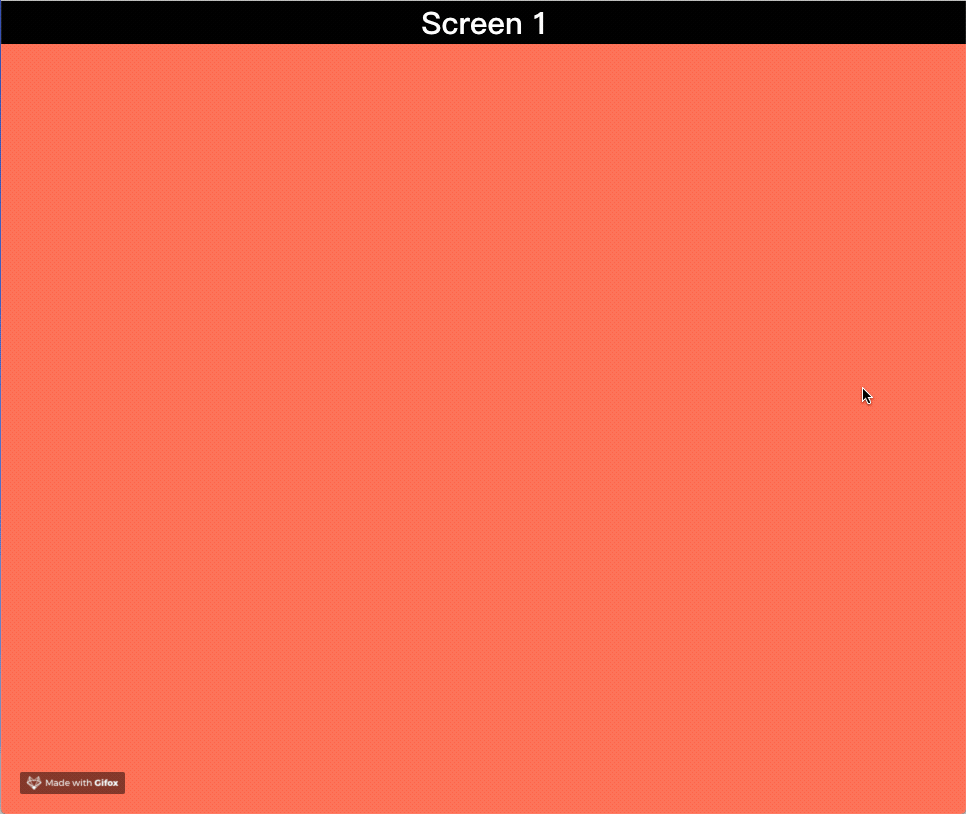

# 100 Days Of Code - Log

### Day 1: Sep 28, 2018 

**Today's Progress:** Got a new feature of CSS3 - Scroll Snap

**Thoughts:** This latest feature can make the web page works as ViewPager in a super concise way, moreover, it's pure CSS code! [Note: check browser compatibility before using]

**Link to work:** 
  [D1 - Snappy Scroll](./CSS/D1-SnappyScroll.html)
  [MDN - CSS Scroll_Snap](https://developer.mozilla.org/en-US/docs/Web/CSS/CSS_Scroll_Snap)
  [Check the browsers support version](https://caniuse.com/#search=scroll-snap)

### Day 2: Sep 29, 2018 

**Today's Progress:** The weird vertical padding

**Thoughts:** Vertical padding is relative to element's width not height. For example, `padding-top: 50%;` does not add 50% of the original *height* of the element as padding, but 50% of the *width* of the *parent* element

**Link to work:** [D2 - Vertical Padding](./codebase/CSS/D2-VerticalPadding.html)

### Day 3: Sep 30, 2018

**Today's Progress:** Start to learn Flutter, built a Simple List as my first Flutter app.

**Thoughts:** After two days working on searching the CSS&HTML material, I realized that I couldn't find a clear goal for what can I use these stuff. I asked myself, which kind of skill I want to develope exactly? Maybe the most relevant to my job, or that I would possibly use in the near future. Finally, I got an answer that Flutter is an ideal choice at the moment.

**Link to work:** [D3 - Simple List](./codebase/Flutter/simplelist)

### Day 4: Oct 2, 2018

**Today's Progress:** Implemented a list item widget by following the Flutter tutorial.

**Thoughts:** I'm starting to take the official Flutter courses on Udacity today. I accomplished the quiz and I preliminarily understand the concept of "almost everything is a widget". I also learnt some of the Dart syntax, such as construction.

**Link to work:** 
  [D4 - Category Widget](./codebase/Flutter/task_02_category_widget)
  [Flutter tutorial - Udacity](https://classroom.udacity.com/courses/ud905)
  [Dart - Sample Code](https://www.dartlang.org/samples)
